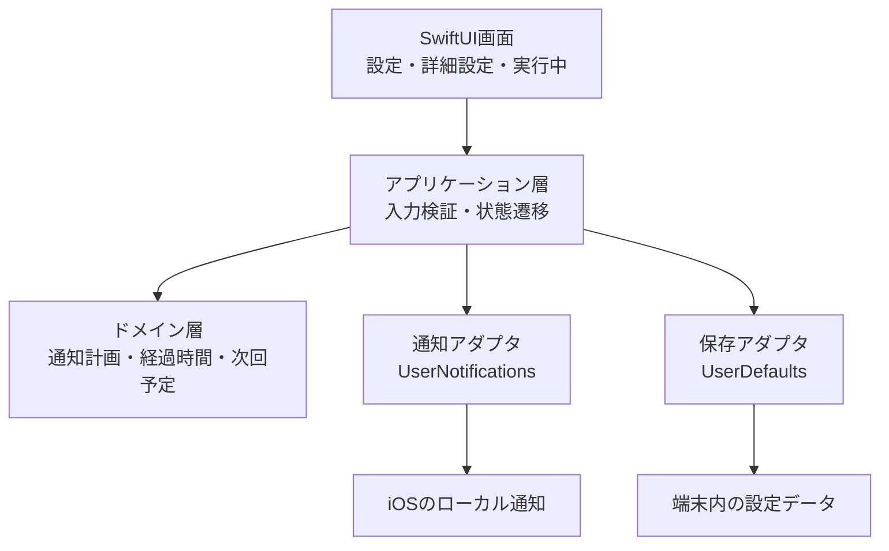

# 技術アーキテクチャ

このドキュメントは、ランニング補給タイマーMVPの技術構成、コンポーネントの責務、データの境界を定義する正本である。機能要件・画面・利用上の制約は [MVP計画](planning-template.md) を参照する。

## 採用構成

| 領域 | 採用技術 | 責務 |
| --- | --- | --- |
| プラットフォーム | iOS 17以上、iPhone、縦向き | アプリの実行・通知・ライフサイクルを提供する |
| 言語・UI | Swift 5.9、SwiftUI | 画面、状態に応じた表示、アクセシビリティを実装する |
| 通知 | UserNotifications | 絶対時刻に変換したローカル通知の権限確認、予約、取消を行う |
| 保存 | UserDefaults | 通知プランと前回選択距離だけを端末内に保存する |
| 品質ゲート | Make、xcodebuild、GitHub Actions | lint、typecheck、test、buildをローカルとCIで同じ入口から実行する（#5で導入） |

外部API、サーバー、DB、ログイン、クラウド同期、広告SDK、解析SDK、課金SDKはMVPに追加しない。

## レイヤーと責務



### SwiftUI画面

- 設定画面、詳細設定画面、実行中画面を表示する
- ユーザー操作をアプリケーション層へ渡し、ドメイン計算やOS APIを直接呼ばない
- VoiceOver、Dynamic Type、エラー・権限拒否の案内を表示する

### アプリケーション層

- 開始、一時停止、再開、終了の状態遷移を調整する
- 入力が有効なときだけ、通知計画の生成と通知予約を実行する
- 保存、通知、画面状態の境界を管理し、OS API失敗時にもセッション状態を破損させない

### ドメイン層

- 通知プランを検証し、給水・補給の時間通知列を生成する
- 同時刻の通知を重複なく扱い、通知済み状態と次回予定を計算する
- 経過時間を `現在時刻 - 開始時刻 - 累積停止時間` から再計算する
- SwiftUI、UserNotifications、UserDefaultsに依存しない。#6で単体テスト可能な形で実装する

### 通知アダプタ

- 通知権限の状態を確認し、開始前に要求する
- ドメイン層が生成した相対時間の予定を絶対時刻へ変換して予約する
- セッション終了時、または予定変更時に、保持した通知IDで未配信通知を取り消す
- 給水／補給を区別する通知文と30秒未満の同梱音声を設定する

### 保存アダプタ

- `SavedPlan` をバージョン付きの小さなデータとして保存・読み込みする
- JSON解析失敗、欠損、型不一致、範囲外、未知バージョンでは安全な初期設定へフォールバックする
- 位置情報、ルート、走行履歴、健康情報、通知履歴は保存しない

## データモデル

```text
SavedPlan { version, selectedDistanceKm, hydration, fuel }
ReminderSetting { isEnabled, firstReminderMinutes, repeatIntervalMinutes, displayName }
Session { state, startedAt, pausedAt?, totalPausedSeconds, scheduledNotificationIDs }
```

- `SavedPlan` は設定の永続化だけに使う。`version` と全フィールドを読み込み時に検証する。
- `Session` は実行中だけ保持する。終了時には `scheduledNotificationIDs` を使い、未配信通知を取り消して破棄する。
- アプリ終了後のセッション復元はMVP対象外である。予約済み通知の取消・再予約は保証しない。

## セッションと通知の流れ

1. 設定画面で有効な通知プランを作成する。
2. アプリケーション層が通知計画を生成し、通知アダプタへ予約を依頼する。
3. 通知アダプタが絶対時刻のローカル通知をiOSへ事前登録する。
4. 実行中画面は基準時刻と累積停止時間から経過時間・次回予定を再計算して表示する。
5. 一時停止では未配信通知を取り消し、再開では停止時間を反映した通知だけを再予約する。
6. 終了では未配信通知を取り消し、実行中セッションを破棄する。

前面、別アプリ前面、画面ロック中の配信はiOSに委ねる。サイレントモード、Focus、音量、ユーザーの通知設定による音・振動・表示は保証しない。Critical Alert、動的TTS、バックグラウンドGPS計測は使用しない。

## 実装予定の構成

#5で作成するXcodeプロジェクトでは、次の責務単位を基本とする。実際のディレクトリ・型名は初期構築時にSwiftの慣例へ合わせて確定する。

```text
RaceFuelTimer/
  App/             アプリ起動と依存の組み立て
  Features/        設定・詳細設定・実行中画面
  Domain/          モデル、検証、スケジュール計算、セッション状態
  Infrastructure/  UserNotifications、UserDefaultsの実装
RaceFuelTimerTests/ ドメイン層とアダプタのテスト
```

機能追加時は、UIからiOS APIや保存実装へ直接依存させず、アプリケーション層またはドメイン層を経由させる。外部連携が必要になる機能はMVP後の別Issueで、保存対象・権限・プライバシー影響を再評価する。
